#Agregar el siguiente producto:
´´´js
{
"sku": "A101",
"name": "Figura Naruto Uzumaki",
"category": "Figuras",
"price": 120000,
"stock": 10,
"anime": "Naruto",
"rating": 4.8,
"tags": ["coleccionable", "resina", "edición especial"],
"provider": {
"name": "OtakuDistribuciones",
"country": "Japón"
}
}
´´´
# con este comando lo insertamos.
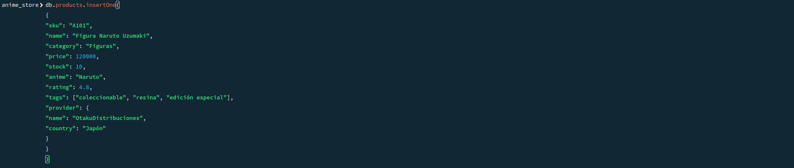

# Agregar a todos los productos las siguientes      
propiedades:
´´´js
​ available: true
​ origin: "Importado"
´´´

# Solucion. 
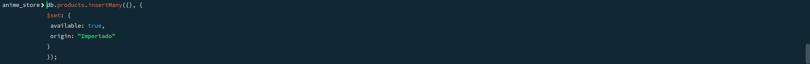
´´´js
db.products.insertMany({},{
    $set: {
        avaliable: true
        origin: "importado"
    }
});
´´´

# Realizar las siguientes actualizaciones:

​ Producto con sku: A034, actualizar stock a 15.
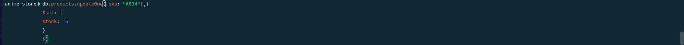
´´´js
db.products.updateOne({sku: "A034"},{
    $set: {
        stock: 15
    }
})
´´´
---
​ Producto con sku: A018, cambiar el country del provider a "Colombia".
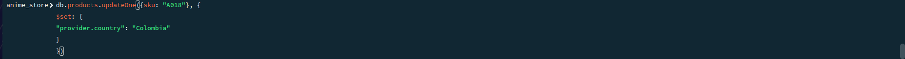
´´´js
db.products.updateOne({sku: "A018"},{
    $set: {
        "provider.country": "Colombia"
    }
})
´´´
---
​ Producto con sku: A059, agregar un nuevo tag: "oferta".
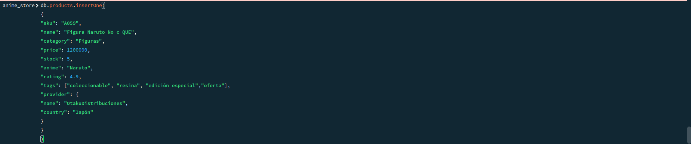
´´´js
{
"sku": "A059",
"name": "Figura Naruto No c QUE",
"category": "Figuras",
"price": 1200000,
"stock": 5,
"anime": "Naruto",
"rating": 4.9,
"tags": ["coleccionable", "resina", "edición especial","oferta"],
"provider": {
"name": "OtakuDistribuciones",
"country": "Japón"
}
}
´´´
Como no estava este registro decici insertarlo con insertOne y le agregue el tag de oferta 
---
​ Producto con sku: A012, agregar dos nuevos tags: "nuevo", "popular".
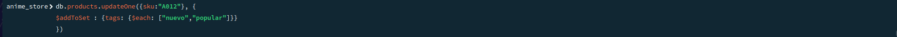
´´´js
db.products.updateOne({sku:"A012}, {
    $addToSet: {tags: {$each: ["nuevo","popular"]}}
})
´´´
---
​ Producto con sku: A025, agregar los tags "descuento", "outlet".
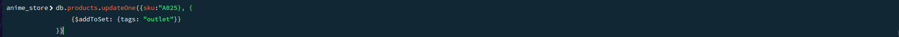
´´´js
db.products.updateOne({sku:"A025}, {
    {$addToSet: {tags: "outlet"}}
})
´´´
---
​ Producto llamado "Camiseta Goku Ultra Instinct", cambiar el price a 45000.
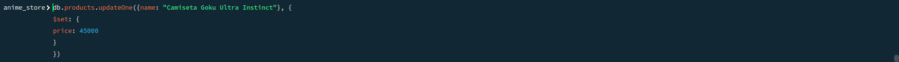
´´´js
db.products.updateOne({name: "Camiseta goku Ultra INting"}), {
    $set: {
        price: 45000
    }
}
´´´
---

Renombrar la propiedad origin a import_type.
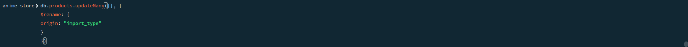
´´´js
db.products.updateMany({}, {
    $rename: {
        origin: "import_type"
    }
})
´´´
---
Cambiar el import_type a "Nacional" para los productos cuyo proveedor esté en
Colombia.
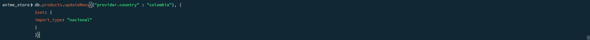
´´´js
db.products.updateMany({"provider.country" : "Colombia"}, {
    $set: {
        import_type: "nacional"
    }
})
´´´

# Crear las siguientes consultas:

​ Mostrar los productos de la categoría "Mangas"
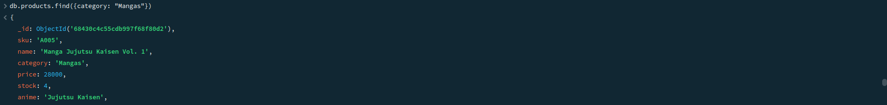
´´´js
db.products.find({category: "Mangas"})
´´´
---
​ Mostrar los productos que tienen un precio mayor a 50000
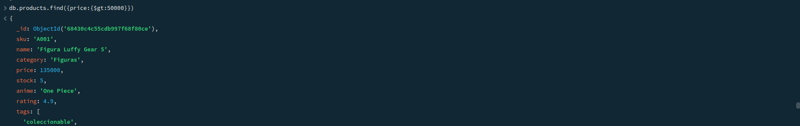
´´´js
db.products.find({price:{$gt·50000}})
´´´
---
​ Mostrar los productos que no son de la categoría "Figuras"
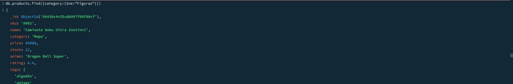
´´´js
db.productos.find({category:{$ne:"Figuras}})
´´´
---
​ Mostrar el sku, name y tags de los productos que tienen calificación mayor a
4.5.
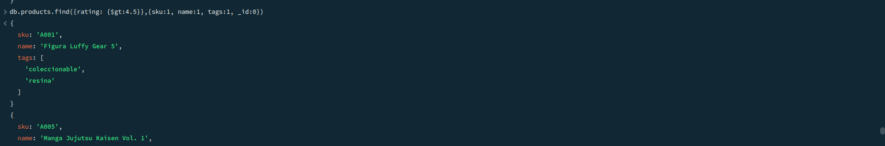
´´´js
db.products.find({rating:{$gt:4.5}},{sku:1, name:1, tags:1, _id:o})
´´´
---